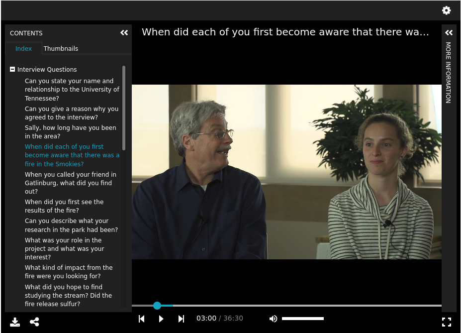

Descriptive Metadata & MODS
===========================

About
-----

The MODS datastream includes our original descriptive metadata about each object.  It informs expectations for search
and indexing and our IIIF manifest. It is built with our `MODS to RDF mapping <https://utk-mods-to-rdf.readthedocs.io/en/latest/index.html>`_ in mind:

A sample MODS record is included here:

.. literalinclude:: ../literals/mods.xml
    :language: xml

Descriptive Metadata
--------------------

============
MODS and RDF
============

Most of our MODS files are used for descriptive metadata only.

For example, the title of our object is found here:

.. literalinclude:: ../literals/mods.xml
    :linenos:
    :language: xml
    :lines: 9-11

According to our `titleInfo mapping <https://utk-mods-to-rdf.readthedocs.io/en/latest/contents/4_draft_mapping.html#titleinfo>`_
the text node value should be mapped to :code:`dcterms:title` in our next system:

.. code-block:: turtle

    @prefix dcterms: <http://purl.org/dc/terms/> .

    <https://example.org/objects/1> dcterms:title "Interview with Seemona and Daniel Whaley, 2019-09-20" .

Similarly, the abstract is here and is intended to be mapped to :code:`dcterms:abstract` according to our mapping for
`this node <https://utk-mods-to-rdf.readthedocs.io/en/latest/contents/4_draft_mapping.html#abstract>`_:

.. literalinclude:: ../literals/mods.xml
    :language: xml
    :lines: 12

.. code-block:: turtle

    @prefix dcterms: <http://purl.org/dc/terms/> .

    <https://example.org/objects/1> dcterms:abstract "Interview with Seemona and Daniel Whaley, former residents of Gatlinburg. The Whaley's discuss the feeling at the time before the fire had become widespread. They also go into detail about the harrowing efforts to evacuate off a mountain that wass engulfed in the fire. Reflections about community relations and how Gatlinburg began to slowly recover are also touched upon. This is a representative quote from the interview: That's where it looked like lava running up the mountain. You could see the fire going uphill." .

While we maintain and MODS to RDF mapping, we also have a metadata mapping that explains how we currently translate
our MODS to IIIF presentation v3.  It is described here:

=====================
The Metadata Property
=====================

Most metadata Elements get mapped to the `metadata <https://iiif.io/api/presentation/3.0/#metadata>`_ property in our
manifest. These are listed here:

+------------------------------+------------------------------------------------------+------------------------------------------------------------------------+
| Label                        | Presentation v3 Field                                | MODS XPath                                                             |
+==============================+======================================================+========================================================================+
| Alternative Title            | metadata.[i].label.en.0."Alternative Title"          | titleInfo[@type="alternative"]'                                        |
+------------------------------+------------------------------------------------------+------------------------------------------------------------------------+
| Table of Contents            | metadata.[i].label.en.0."Table of Contents"          | tableOfContents                                                        |
+------------------------------+------------------------------------------------------+------------------------------------------------------------------------+
| Creators and Contributors    | metadata.[i].label.en.0."Creators and Contributors"  | name/namePart                                                          |
+------------------------------+------------------------------------------------------+------------------------------------------------------------------------+
| Publisher                    | metadata.[i].label.en.0."Publisher"                  | originInfo/publisher                                                   |
+------------------------------+------------------------------------------------------+------------------------------------------------------------------------+
| Date                         | metadata.[i].label.en.0."Date"                       | originInfo/dateCreated | originInfo/dateOther                          |
+------------------------------+------------------------------------------------------+------------------------------------------------------------------------+
| Publication Date             | metadata.[i].label.en.0."Publication Date"           | originInfo/dateIssued                                                  |
+------------------------------+------------------------------------------------------+------------------------------------------------------------------------+
| Format                       | metadata.[i].label.en.0."Format"                     | physicalDescription/form[not(@type="material")]                        |
+------------------------------+------------------------------------------------------+------------------------------------------------------------------------+
| Extent                       | metadata.[i].label.en.0."Extent"                     | physicalDescription/extent                                             |
+------------------------------+------------------------------------------------------+------------------------------------------------------------------------+
| Subject                      | metadata.[i].label.en.0."Subject"                    | subject[not(@displayLabel="Narrator Class")]/topic                     |
+------------------------------+------------------------------------------------------+------------------------------------------------------------------------+
| Narrator Role                | metadata.[i].label.en.0."Narrator Role"              | subject[@displayLabel="Narrator Class"]/topic                          |
+------------------------------+------------------------------------------------------+------------------------------------------------------------------------+
| Place                        | metadata.[i].label.en.0."Place"                      | subject/geographic                                                     |
+------------------------------+------------------------------------------------------+------------------------------------------------------------------------+
| Time Period                  | metadata.[i].label.en.0."Time Period"                | subject/temporal                                                       |
+------------------------------+------------------------------------------------------+------------------------------------------------------------------------+
| Publication Identifier       | metadata.[i].label.en.0."Publication Identifier"     | identifier[@type="isbn"] | identifier[@type="issn"]                    |
+------------------------------+------------------------------------------------------+------------------------------------------------------------------------+
| Description                  | metadata.[i].label.en.0."Description"                | abstract[not(@lang)]                                                   |
+------------------------------+------------------------------------------------------+------------------------------------------------------------------------+
| Descripción                  | metadata.[i].label.es.0."Descripción"                | abstract[@lang="spa"]                                                  |
+------------------------------+------------------------------------------------------+------------------------------------------------------------------------+
| Título                       | metadata.[i].label.es.0."Título"                     | titleInfo[@lang="spa"]/title                                           |
+------------------------------+------------------------------------------------------+------------------------------------------------------------------------+
| [Role of a Person to a Work] | metadata.[i].label.en.0.[Role of a Person to a Work] | mods:name[mods:role[mods:roleTerm[text()='{$current}']]]/mods:namePart |
+------------------------------+------------------------------------------------------+------------------------------------------------------------------------+
| Browse                       | metadata.[i].label.en.0.Browse                       | note[@displayLabel="Browse"]                                           |
+------------------------------+------------------------------------------------------+------------------------------------------------------------------------+

Most of those are straight forward, but there are a few things to note.

Two elements get mapped with a Spanish language code rather than English:

* Descripción
* Título

We have many role terms that we use in our repository.  In RFTA, currently we only have an `Interviewer` and an `Interviewee`.
If this was to expand those names would be stored in a unique field according to the role of the person and their
relationship to the work.

================
Other Properties
================

There are other metadata elements that are stored outside the metadata property.  Those are:

+-------------+-------------------------------+-------------------------------------------------+
| Label       | Presentation v3 Field         | XPath                                           |
+=============+===============================+=================================================+
| Label       | label.en[0]                   | titleInfo[not(@type="alternative")][not(@lang)] |
+-------------+-------------------------------+-------------------------------------------------+
| Summary     | summary.en[0]                 | abstract[not(@lang)]                            |
+-------------+-------------------------------+-------------------------------------------------+
| Rights      | rights                        | accessCondition[@xlink:href]                    |
+-------------+-------------------------------+-------------------------------------------------+
| Provided by | requiredStatement.label.en[0] | recordInfo/recordContentSource                  |
+-------------+-------------------------------+-------------------------------------------------+

Structures, Ranges, and Additional Expectations
-----------------------------------------------

The MODS record also includes a PBCore extension that is intended to be used to create navigable sections to the video.
This is this section of the MODS:

.. literalinclude:: ../literals/rfta_74.xml
    :language: xml
    :lines: 77-280

There is a lot going on here, but this will explain the original intention so that we can discuss potential options.

First, it's important to note that we set out to deliver this collection following the
`IIIF Presentation v3 specification <https://iiif.io/api/presentation/3.0/>`_.

The data team had gone threw each video and divided it into at least one, but sometimes two, ranges. Each range had
sections that related to a timestamp or set of timestamps. To make use of the data creations team's sectioning of videos,
we planned to use `structures and ranges <https://iiif.io/api/presentation/3.0/#54-range>`_.

To understand what we were attempting to do with this, let's take a look at one of our `sample IIIF manifests <https://uv-v3.netlify.app/#?c=&m=&s=&cv=&manifest=https://raw.githubusercontent.com/utkdigitalinitiatives/utk_iiif_recipes/main/raw_manifests/rfta_video.json>`_
in the new version of Universal Viewer.

You can see that when you click the index, you have actionable anchors that forward you to the correct part of the video.

The same can be said about the Viewer in our application, `canopy <https://github.com/utkdigitalinitiatives/canopy/>`_.

The interview questions section gets populated into our manifest like so:

.. literalinclude:: ../literals/rfta_video.json
    :language: json
    :lines: 87-94

This is informed by our MODS based on the :code:`pbcorePart[@partType]` value:

.. literalinclude:: ../literals/mods.xml
    :language: xml
    :lines: 97-99

Each unique value of this attribute indicates that there should be a new range.  This record only has one.

Similary, each of these nodes points out a new range in that range.  For instance, the part of the video shown above
goes into our manifest like this:

.. literalinclude:: ../literals/rfta_video.json
    :language: json
    :lines: 134-146

This is informed by our MODS in this section:

.. literalinclude:: ../literals/rfta_74.xml
    :language: xml
    :lines: 104-110

Many of the values here are unused.  The significant XPaths are:

* :code:`pbcore:pbcorePart[@partType]` which states the range it should belong to.
* :code:`pbcore:pbcoreTitle` which states the title of the sub range.
* :code:`pbcore:pbcorePart[@startTime]` which is a human readable start time that we convert on the fly to a W3C mediafragment.
* :code:`pbcore:pbcorePart[@endTime]` which is a human readable end time that we convert on the fly to a W3C mediafragment.
