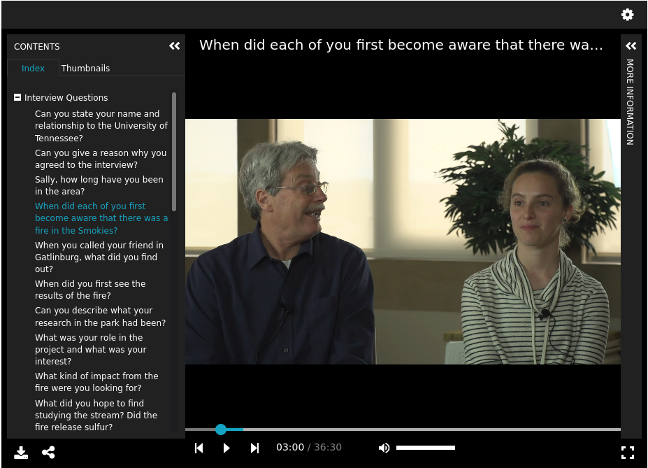

IIIF Assemble
=============

About
-----

Digital Initiatives maintains a standalone PHP application that generates presentation v3 manifests on the fly called
`iiif assemble <https://github.com/utkdigitalinitiatives/iiif_assemble>`_.

This section describes this application and its relationship to the Rising from the Ashes project.

Why Assemble?
-------------

In early 2021, Digital Initiatives decided it could deliver the Rising from the Ashes project with IIIF.  While we knew
we could do this, we recognized that it would require developing a few pieces of technology. The first of those was IIIF
assemble.

In order to serve audio and video with IIIF, presentation v3 is required. While there are a few projects in Islandora
related to IIIF presentation, none of them are based on version 3 of the specification.  For this reason, we needed an
application that generated IIIF v3 presentation manifests for objects in Islandora 7.  This was because we decided in
early 2021, that it would be unacceptable for these files to be static. In order to address this problem, it was decided
that the developers would build a IIIF assemble application using the lingua franca programming language of the group:
PHP.

The current version of the software can be found in the `departmental Github <https://github.com/utkdigitalinitiatives/iiif_assemble>`_.

Running Assemble in Production
------------------------------

Assemble is installed on digital at :code:`/vhosts/digital/web/assemble`.

Configuration of the application is done by the systems administrators.

The :code:`main` branch is used in production.

The application can be updated with :code:`sudo git pull`.

Running Assemble in Development
-------------------------------

Assemble can be run in the `utk_digital vagrant box <https://github.com/utkdigitalinitiatives/utk_digital>`_. To do this,
you must follow the instructions in the README of that repo.

There is one catch.  Audio and Video content models are expected to have durations.  You'll need to add a duration with
API-M to get this to work as expected.  See the RELS-INT section of these docs for more information.

Assemble and RFTA
-----------------

=========================
Audio and Video Manifests
=========================

IIIF assemble builds a Presentation v3 manifest for each object in RFTA. The metadata model follows the default for all
other content except in a few ways.

Since this is timebased, the manifest has a :code:`duration` property that is generated from an expected
:code:`bibframe:duration` property in the RELS-INT that refers to the access datastream.

The other differences are described in corresponding sections below (structures and ranges).

====================
Collection Manifests
====================

Canopy, our platform for serving things, needs a presentation manifest for the collection object.  This application
builds that using its `collection module <https://github.com/utkdigitalinitiatives/iiif_assemble/blob/main/src/Collection.php>`_.

=====================
The Metadata Property
=====================

Most metadata elements from MODS get mapped to the `metadata <https://iiif.io/api/presentation/3.0/#metadata>`_ property in our
manifest. These are listed here:

+------------------------------+------------------------------------------------------+------------------------------------------------------------------------+
| Label                        | Presentation v3 Field                                | MODS XPath                                                             |
+==============================+======================================================+========================================================================+
| Alternative Title            | metadata.[i].label.en.0."Alternative Title"          | titleInfo[@type="alternative"]'                                        |
+------------------------------+------------------------------------------------------+------------------------------------------------------------------------+
| Table of Contents            | metadata.[i].label.en.0."Table of Contents"          | tableOfContents                                                        |
+------------------------------+------------------------------------------------------+------------------------------------------------------------------------+
| Creators and Contributors    | metadata.[i].label.en.0."Creators and Contributors"  | name/namePart                                                          |
+------------------------------+------------------------------------------------------+------------------------------------------------------------------------+
| Publisher                    | metadata.[i].label.en.0."Publisher"                  | originInfo/publisher                                                   |
+------------------------------+------------------------------------------------------+------------------------------------------------------------------------+
| Date                         | metadata.[i].label.en.0."Date"                       | originInfo/dateCreated | originInfo/dateOther                          |
+------------------------------+------------------------------------------------------+------------------------------------------------------------------------+
| Publication Date             | metadata.[i].label.en.0."Publication Date"           | originInfo/dateIssued                                                  |
+------------------------------+------------------------------------------------------+------------------------------------------------------------------------+
| Format                       | metadata.[i].label.en.0."Format"                     | physicalDescription/form[not(@type="material")]                        |
+------------------------------+------------------------------------------------------+------------------------------------------------------------------------+
| Extent                       | metadata.[i].label.en.0."Extent"                     | physicalDescription/extent                                             |
+------------------------------+------------------------------------------------------+------------------------------------------------------------------------+
| Subject                      | metadata.[i].label.en.0."Subject"                    | subject[not(@displayLabel="Narrator Class")]/topic                     |
+------------------------------+------------------------------------------------------+------------------------------------------------------------------------+
| Narrator Role                | metadata.[i].label.en.0."Narrator Role"              | subject[@displayLabel="Narrator Class"]/topic                          |
+------------------------------+------------------------------------------------------+------------------------------------------------------------------------+
| Place                        | metadata.[i].label.en.0."Place"                      | subject/geographic                                                     |
+------------------------------+------------------------------------------------------+------------------------------------------------------------------------+
| Time Period                  | metadata.[i].label.en.0."Time Period"                | subject/temporal                                                       |
+------------------------------+------------------------------------------------------+------------------------------------------------------------------------+
| Publication Identifier       | metadata.[i].label.en.0."Publication Identifier"     | identifier[@type="isbn"] | identifier[@type="issn"]                    |
+------------------------------+------------------------------------------------------+------------------------------------------------------------------------+
| Description                  | metadata.[i].label.en.0."Description"                | abstract[not(@lang)]                                                   |
+------------------------------+------------------------------------------------------+------------------------------------------------------------------------+
| Descripción                  | metadata.[i].label.es.0."Descripción"                | abstract[@lang="spa"]                                                  |
+------------------------------+------------------------------------------------------+------------------------------------------------------------------------+
| Título                       | metadata.[i].label.es.0."Título"                     | titleInfo[@lang="spa"]/title                                           |
+------------------------------+------------------------------------------------------+------------------------------------------------------------------------+
| [Role of a Person to a Work] | metadata.[i].label.en.0.[Role of a Person to a Work] | mods:name[mods:role[mods:roleTerm[text()='{$current}']]]/mods:namePart |
+------------------------------+------------------------------------------------------+------------------------------------------------------------------------+
| Browse                       | metadata.[i].label.en.0.Browse                       | note[@displayLabel="Browse"]                                           |
+------------------------------+------------------------------------------------------+------------------------------------------------------------------------+

Most of those are straight forward, but there are a few things to note.

Two elements get mapped with a Spanish language code rather than English:

* Descripción
* Título

We have many role terms that we use in our repository.  In RFTA, currently we only have an `Interviewer` and an `Interviewee`.
If this was to expand those names would be stored in a unique field according to the role of the person and their
relationship to the work.

You can read more about how this is done in the Manifest module and the :code:`IIIF::buildMetadata()` method of
`iiif_assemble <https://github.com/utkdigitalinitiatives/iiif_assemble/blob/8d0c059c95826cb0f43fbdfb6cbf04b3db83b74e/src/IIIF.php#L91>`_.

.. code-block:: php

    public function buildMetadata () {

        $metadata = array(
            'Alternative Title' => $this->xpath->query('titleInfo[@type="alternative"]'),
            'Table of Contents' => $this->xpath->query('tableOfContents'),
            'Publisher' => $this->xpath->query('originInfo/publisher'),
            'Date' => $this->xpath->query('originInfo/dateCreated|originInfo/dateOther'),
            'Publication Date' => $this->xpath->query('originInfo/dateIssued'),
            'Format' => $this->xpath->query('physicalDescription/form[not(@type="material")]'),
            'Extent' => $this->xpath->query('physicalDescription/extent'),
            'Subject' => $this->xpath->query('subject[not(@displayLabel="Narrator Class")]/topic'),
            'Narrator Role' => $this->xpath->query('subject[@displayLabel="Narrator Class"]/topic'),
            'Place' => $this->xpath->query('subject/geographic'),
            'Time Period' => $this->xpath->query('subject/temporal'),
            'Publication Identifier' => $this->xpath->queryFilterByAttribute('identifier', false, 'type', ['issn','isbn'])
        );
        $metadata_with_names = $this->add_names_to_metadata($metadata);
        return self::validateMetadata($metadata_with_names);

    }

================
Other Properties
================

There are other metadata elements that are stored outside the metadata property.  Those are:

+-------------+-------------------------------+-------------------------------------------------+
| Label       | Presentation v3 Field         | XPath                                           |
+=============+===============================+=================================================+
| Label       | label.en[0]                   | titleInfo[not(@type="alternative")][not(@lang)] |
+-------------+-------------------------------+-------------------------------------------------+
| Summary     | summary.en[0]                 | abstract[not(@lang)]                            |
+-------------+-------------------------------+-------------------------------------------------+
| Rights      | rights                        | accessCondition[@xlink:href]                    |
+-------------+-------------------------------+-------------------------------------------------+
| Provided by | requiredStatement.label.en[0] | recordInfo/recordContentSource                  |
+-------------+-------------------------------+-------------------------------------------------+

You can read more about this in the Manifest module and the :code:`IIIF::buildManifest()` method of
`iiif_assemble <https://github.com/utkdigitalinitiatives/iiif_assemble/blob/8d0c059c95826cb0f43fbdfb6cbf04b3db83b74e/src/IIIF.php#L64>`_.

.. code-block:: php

    public function buildManifest ()
    {
        $id = $this->url . str_replace('?update=1', '', $_SERVER["REQUEST_URI"]);

        $manifest['@context'] = ['https://iiif.io/api/presentation/3/context.json'];
        $manifest['id'] = $id;
        $manifest['type'] = 'Manifest';
        $manifest['label'] = self::getLanguageArray($this->xpath->query('titleInfo[not(@type="alternative")]'), 'value');
        $manifest['summary'] = self::getLanguageArray($this->xpath->query('abstract'), 'value');
        $manifest['metadata'] = self::buildMetadata();
        $manifest['rights'] = self::buildRights();
        $manifest['requiredStatement'] = self::buildRequiredStatement();
        $manifest['provider'] = self::buildProvider();
        $manifest['thumbnail'] = self::buildThumbnail(200, 200);
        $manifest['items'] = self::buildItems($id);
        $manifest['seeAlso'] = self::buildSeeAlso();

        if ($this->type === 'Book') {
            $manifest['behavior'] = ["paged"];
        }

        $presentation = self::buildStructures($manifest, $id);

        return json_encode($presentation);

    }

Structures, Ranges, and Additional Expectations
-----------------------------------------------

The MODS record also includes a PBCore extension that is intended to be used to create navigable sections to the video.
This is this section of the MODS:

.. literalinclude:: ../literals/rfta_74.xml
    :language: xml
    :lines: 77-280

There is a lot going on here, but this will explain the original intention so that we can discuss potential options.

First, it's important to note that we set out to deliver this collection following the
`IIIF Presentation v3 specification <https://iiif.io/api/presentation/3.0/>`_.

The data team had gone threw each video and divided it into at least one, but sometimes two, ranges. Each range had
sections that related to a timestamp or set of timestamps. To make use of the data creations team's sectioning of videos,
we planned to use `structures and ranges <https://iiif.io/api/presentation/3.0/#54-range>`_.

To understand what we were attempting to do with this, let's take a look at one of our `sample IIIF manifests <https://uv-v3.netlify.app/#?c=&m=&s=&cv=&manifest=https://raw.githubusercontent.com/utkdigitalinitiatives/utk_iiif_recipes/main/raw_manifests/rfta_video.json>`_
in the new version of Universal Viewer.

You can see that when you click the index, you have actionable anchors that forward you to the correct part of the video.

The same can be said about the Viewer in our application, `canopy <https://github.com/utkdigitalinitiatives/canopy/>`_.

The interview questions section gets populated into our manifest like so:

.. literalinclude:: ../literals/rfta_video.json
    :language: json
    :lines: 87-94

This is informed by our MODS based on the :code:`pbcorePart[@partType]` value:

.. literalinclude:: ../literals/mods.xml
    :language: xml
    :lines: 97-99

Each unique value of this attribute indicates that there should be a new range.  This record only has one.

Similary, each of these nodes points out a new range in that range.  For instance, the part of the video shown above
goes into our manifest like this:

.. literalinclude:: ../literals/rfta_video.json
    :language: json
    :lines: 134-146

This is informed by our MODS in this section:

.. literalinclude:: ../literals/rfta_74.xml
    :language: xml
    :lines: 104-110

Many of the values here are unused.  The significant XPaths are:

* :code:`pbcore:pbcorePart[@partType]` which states the range it should belong to.
* :code:`pbcore:pbcoreTitle` which states the title of the sub range.
* :code:`pbcore:pbcorePart[@startTime]` which is a human readable start time that we convert on the fly to a W3C mediafragment.
* :code:`pbcore:pbcorePart[@endTime]` which is a human readable end time that we convert on the fly to a W3C mediafragment.
