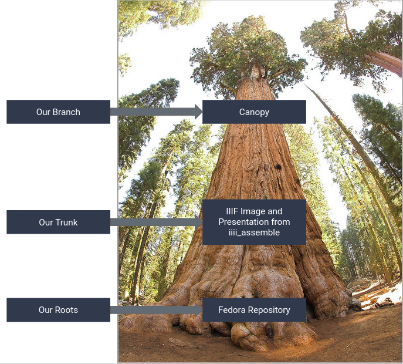
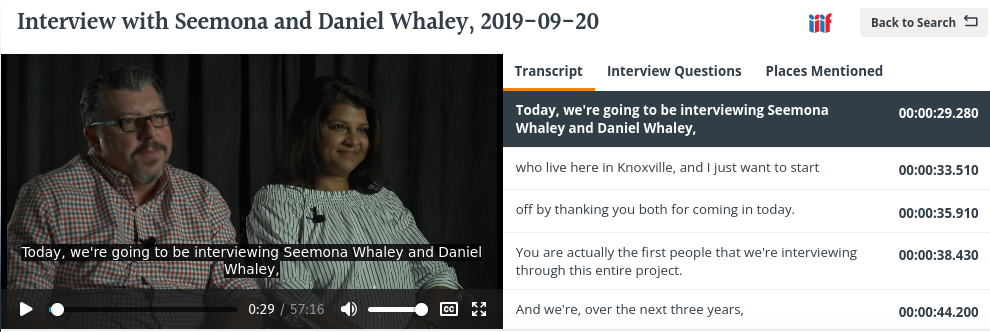
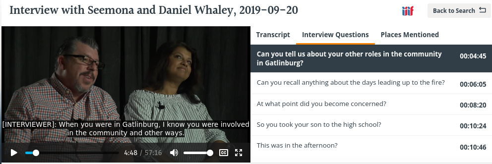

Canopy
======

About
-----

Digital Initiatives maintains a standalone Jamstack application that reads in and indexes IIIF presentation v3 manifests
for audio and video objects and serves them with an in house built viewer. The application is called
`canopy <https://github.com/utkdigitalinitiatives/canopy>`_.

The name is derived from a departmental mantra where we see IIIF as our "trunk" for serving data from our repository to
many frontends. This idea originates from a presentation given at CNI in Fall 2020 by Esme Cowles and Mark Matienzo. In
`A Tree’s Strength Is Its Trunk: IIIF as Central Operational Infrastructure <https://www.cni.org/topics/standards/a-trees-strength-is-its-trunk-iiif-as-central-operational-infrastructure>`_,
Cowles and Matienzo discuss what they describe as a trunk and branches model with IIIF. The `trunk` are the many IIIF API
specifications. Connected to a repository platform at its roots, information about the objects in the repository can be
published as IIIF and served to and embedded in many `branch` frontend applications for discovery and dissemination.

Using the many IIIF specifications, we felt we could serve our content to a variety of applications. Until we were able
to launch a new digital collections platform, this meant we needed a `branch` application for the audio and video oral histories
in this collection. To solve this problem, we developed a new application called `canopy` to serve our content to the
outside world.

This section describes this application and its relationship to the Rising from the Ashes project specifically.

Canopy and its Relationship to our Repository
---------------------------------------------

Canopy and its relationship to our repository can be understood in the `IIIF as a Trunk` model.

In this model, our Fedora 3.8 repository stores the oral history objects and its associated binary files and metadata.
I like to think about this as the `roots` of our tree.

IIIF Presentation and Image built by iiif_assemble are the `trunk` of the tree and feeds our frontend application.

Canopy is the `branch` and presents our objects to the outside world.

The Canopy Stack
----------------

Canopy is a `Jamstack <https://jamstack.org/>`_ built with Gatsby, React, HTML 5, GraphQL, Lunr, and IIIF presentation v3.
The application has a config file that generates a site from `IIIF Presentation v3 collection manifest
<https://github.com/utkdigitalinitiatives/canopy/blob/f44316878c27436d209b7c118b1f7a92d8691cfc/gatsby-node.js#L13>`_.

When the site is `"built"`, each manifest mentioned in that manifest is indexed. Those manifests include metadata, links
to the video or audio objects, thumbnails, webVTT transcripts, and presentation structures and ranges that link to
specific points in the audio or video collection. Static HTML pages are created and cached from the build process for
performance reasons. The application leverages each individual manifest on build to grab its transcript, metadata,
thumbnail, etc. and stores that data with Lunr and the Gatsby GraphQL endpoint.  We use netlify for deployment, so you
can see the current build `here <https://iiif-canopy.netlify.app/>`_. This is still being actively worked on and is
subject to change.

Canopy defines many components that leverage aspects from these manifests.

The Object View
---------------

The `object view <https://iiif-canopy.netlify.app/object/seemona-and-daniel-whaley-2019-09-20>`_ displays the object in
a player with closed captioning, metadata from the manifest that describes the object, any associated transcript(s), and
any defined IIIF ranges in the incoming manifest.

When the object plays and state changes, the elements from the transcript(s) and range(s) move with each object.
At any point, if someone interacts with one of the elements in a transcript or range components, state is updated
accordingly, and the video, range(s), and transcript(s) move to the appropriate timestamp. This is all done in
accordance with IIIF Presentation v3, webVTT, and the browser’s interpretation of HTML 5.

    A Representation of the Whaley Oral History's Transcript Component in Canopy

    A Representation of the Whaley Oral History' Range Component in Canopy

`Some objects <https://iiif-canopy.netlify.app/object/julia-rodriguez-2021-03-03>`_ have multiple language translations
and transcripts. `Some objects <https://iiif-canopy.netlify.app/object/andrea-ludden-2017-02-06>`_ have multiple ranges.

As you can see, we use our own “player” based heavily on the embedded HTML 5 player.  We started with Mirador, but we
had a difficult time controlling state within it.  We heard that Indiana was working on something similar, but it wasn't
where it needed to be to fit our timeline.

